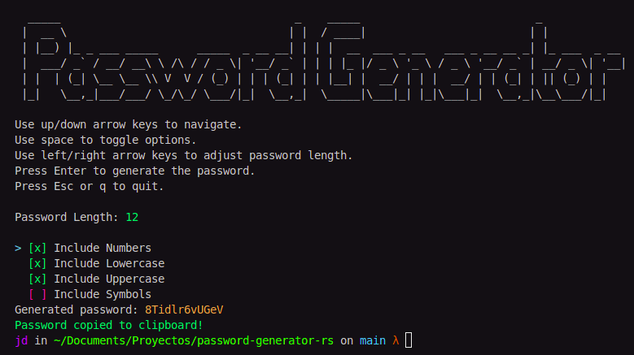

# 🔐 Password Generator (Rust CLI)



A secure and customizable command-line interface (CLI) tool built with Rust for generating strong, random passwords. This project emphasizes security, performance, and ease of use, allowing users to quickly generate passwords with specified criteria and copy them directly to their clipboard.

## ✨ Features

- **Customizable Length**: Generate passwords from 8 to 40 characters long.
- **Character Set Options**: Include or exclude numbers, lowercase letters, uppercase letters, and symbols.
- **Clipboard Integration**: Automatically copies the generated password to your system clipboard for convenience.
- **Interactive CLI**: User-friendly interface for selecting password criteria.

## 🚀 Getting Started

### Prerequisites

- [Rust](https://www.rust-lang.org/tools/install) (latest stable version recommended)
- [Make](https://www.gnu.org/software/make/) (usually pre-installed on Linux/macOS, available via Chocolatey on Windows)

### Installation

Download the binary from the [Releases](https://github.com/jd-apprentice/password-generator-rs/releases)

Make it executable with

```shell
chmod +x $HOME/Downloads/password-generator-x86_64
```

Move it and rename it with the name you want

```shell
sudo mv $HOME/Downloads/password-generator-x86_64 /usr/local/bin/pass-rs
```

Compile it yourself if you want

1. **Clone the repository:**
   ```bash
   git clone https://github.com/jd-apprentice/password-generator-rs.git
   cd password-generator-rs
   ```

2. **Run the project**
   ```bash
   make
   ```

#### Interactive Mode

Once the application starts, you will be presented with an interactive menu:

- Use **Up/Down Arrow Keys** to navigate between options.
- Use **Spacebar** to toggle character set options (Numbers, Lowercase, Uppercase, Symbols).
- Use **Left/Right Arrow Keys** to adjust the password length (min 8, max 40).
- Press **Enter** to generate the password.
- Press **Esc** or **q** to quit the application.

The generated password will be displayed and automatically copied to your clipboard.

## 🛠️ Development

### Running in Development Mode

To run the project in development mode with hot-reloading (if configured) and debug symbols:

```bash
make dev
```

## 🤝 Contributing

Contributions are welcome! Please check the [CONTRIBUTING.md](CONTRIBUTING.md) file for guidelines on how to contribute.

## 📄 License

This project is licensed under the MIT License. See the [LICENSE-MIT](LICENSE-MIT) file for details.

## 📞 Contact

For any questions or feedback, please open an issue on the GitHub repository.
